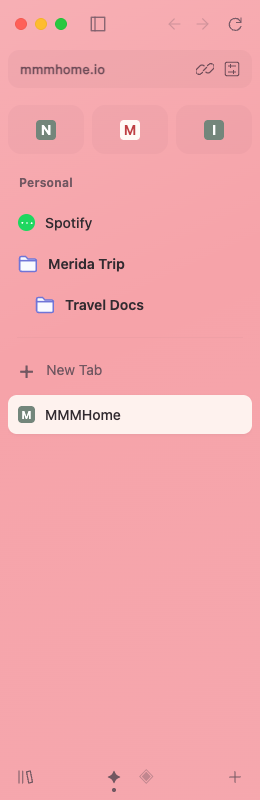

# Arc sidebar in the Helium fork

This branch adds an Arc-style sidebar to Helium’s expanded Vertical layout. New
profiles default to that layout. Existing profiles can select **Vertical** from
Helium’s browser layout menu. The sidebar uses the supplied Arc screenshots as
its visual reference.



## Implemented

- Favorites shared between spaces within a window, saved pins, ordinary tabs,
  a selected-tab pill, favicon tiles, and coral/lavender/custom space colors.
- Nested folders with expand/collapse, rename, creation, deletion, drag nesting,
  ordering, and moves between spaces. Dropping near a folder’s top edge reorders;
  dropping in its center nests. Context menus provide keyboard alternatives.
- Space creation, rename, deletion (preserving tabs), switching, color selection,
  horizontal trackpad switching, and remembered active tabs.
- A searchable tab palette, address/search field, history navigation, reload,
  copy URL, and settings. Pinned entries retain their home URL and chosen title
  after navigation or closure; selecting a closed pin reopens it.
- Real Chromium `TabStripModel` observation and browser navigation via a native
  WebUI bridge, with coalesced updates, favicon data from Chromium’s local cache,
  and window workspaces in profile preferences. Incognito starts with a separate
  workspace and writes through the off-the-record preference service.
- Keyboard tree navigation, focus indicators, accessible labels, reduced-motion
  support, folder cycle checks, and safe text rendering.

## Source layout

`resources/arc_sidebar/` contains the production HTML, CSS, JavaScript, and
DOM-independent workspace model. The existing resource manifest installs these
files into Chromium. `preview.mjs` is a development adapter and is deliberately
excluded from the production manifest.

`patches/helium/ui/layout/arc-sidebar.patch` adds the native host and message
handler, registers `chrome://arc-sidebar`, embeds a WebView in the vertical tab
region, wires address-bar focus, and registers the preference. The page can only
control a browser when its WebContents was created by the native sidebar host.
Navigating a regular tab to that URL does not grant the browser capability.

The native patch is last in `patches/series`, after Helium’s existing layout,
material, and toolbar changes. Modify it using the normal Chromium source/quilt
workflow when working in a full build tree.

## Run the interactive preview

From the repository root:

```sh
python3 -m http.server 4173 --bind 127.0.0.1
```

Open `http://127.0.0.1:4173/devutils/arc_sidebar/preview.html`. It uses the exact
production sidebar with a local adapter in place of Chromium’s message handler.
The sample website on its right is a preview canvas, not browser web content.
The preview stores its own data in localStorage; **Reset preview** clears it.

## Verify

```sh
node --test devutils/arc_sidebar/model.test.mjs
npm ci --prefix devutils/arc_sidebar
cd devutils/arc_sidebar
npx playwright install chromium --with-deps
npm test
```

To use an existing browser executable, set `ARC_CHROME_PATH` when running the
suite. Browser tests always launch a temporary profile. They test the production
sidebar UI with the development adapter; they do not test the compiled C++ host.

From the repository root:

```sh
python3 devutils/validate_config.py
python3 devutils/arc_sidebar/validate_native_patch.py
```

The latter downloads only the eleven Chromium files touched by the native patch,
then applies the relevant Helium predecessors and the new patch with zero fuzz.
It checks applicability to the version in `chromium_version.txt`; it does not
compile Chromium.

## Build the browser

Use Helium’s macOS packaging repository and its documented development workflow:
https://github.com/imputnet/helium-macos/blob/main/docs/building.md

Point that packaging repository’s Helium submodule at this fork’s `arc-sidebar`
branch before source preparation, then run its `he setup`, `he build`, and
`he run` steps. The complete Chromium checkout and build require substantially
more disk space than the lightweight patch validation above.

## Verification status and remaining work

The model and browser interaction tests pass. The patch applies cleanly to
Chromium 153.0.8010.52 after Helium’s existing patches, and Helium’s configuration
checks pass. **A complete native Helium binary has not been compiled or run.**

Visual parity is currently checked in the interactive preview. This is not a
verified 1:1 Arc replacement. Native frame alignment, traffic-light hit testing,
resize transitions, lifecycle behavior, and macOS accessibility still require
validation in the compiled browser. Collapsed, fullscreen, and Zen layouts use
Helium’s original controls. Native global new-tab shortcuts retain Chromium’s
new-tab behavior; the sidebar’s New Tab button opens the palette. Spaces organize
tabs within a browser window; they are not separate cookie/profile containers.
Windows save independently and a new/restored window seeds from the last saved
workspace; restoring several windows needs dedicated native session tests.
